# 2D Advection Results (DG Method)

This repository presents numerical results for the 2D linear advection equation solved using a Discontinuous Galerkin (DG) method under different CFL conditions and flow directions.

---

## 🔧 Numerical Setup

* Polynomial degree: `k = 4`
* Order parameter: `N = k + 1`
* Flux type: `upwind`
* LF dissipation parameter: `alpha_LF = 1.0`
* Mass matrix: `M_inv_projected`
* Boundary condition: **Periodic boundary exchange (週期性邊界交換)**

---

# 📁 Case A: FinalTime = 1, CFL = 0.05

---

## 🔹 A1. x-direction advection

* Velocity field: **(u, v) = (1, 0)**
* Exact solution:

```python
q_expr = sp.sin(2 * np.pi * (x - t))
```

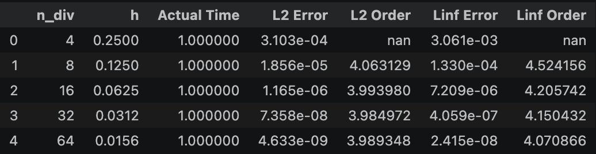

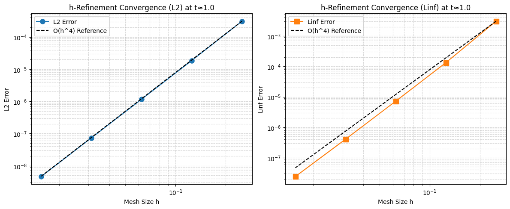

---

## 🔹 A2. y-direction advection

* Velocity field: **(u, v) = (0, 1)**
* Exact solution:

```python
q_expr = sp.sin(2 * np.pi * (y - t))
```

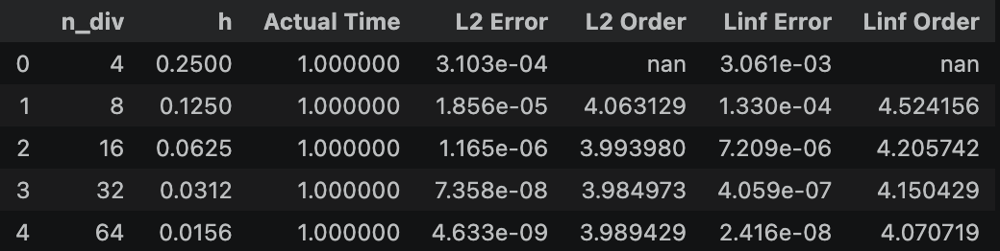
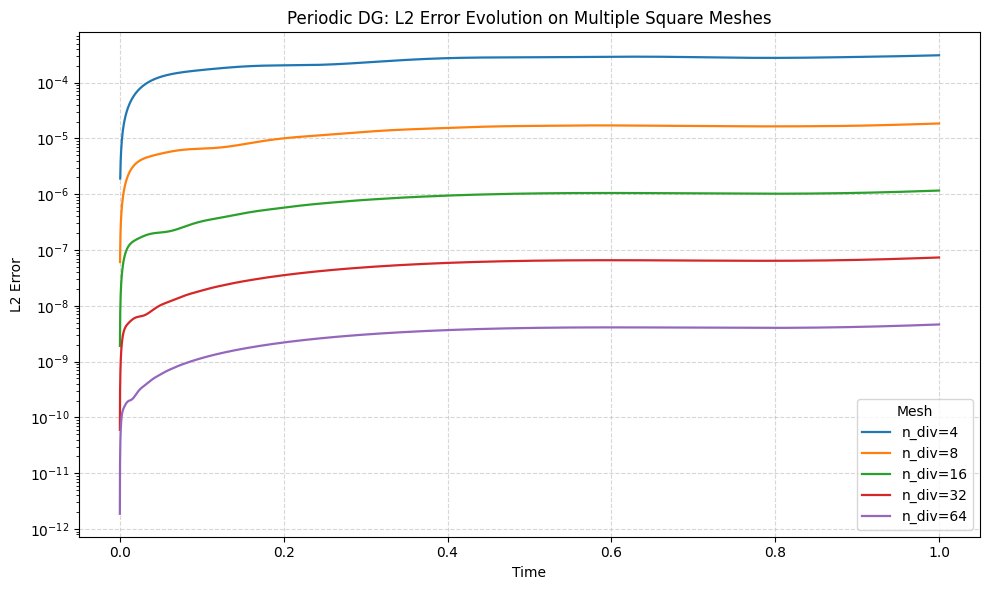


---

## 🔹 A3. Diagonal advection (xy)

* Velocity field: **(u, v) = (1, 1)**
* Exact solution:

```python
q_expr = sp.sin(2 * np.pi * (x + y - 2 * t))
```

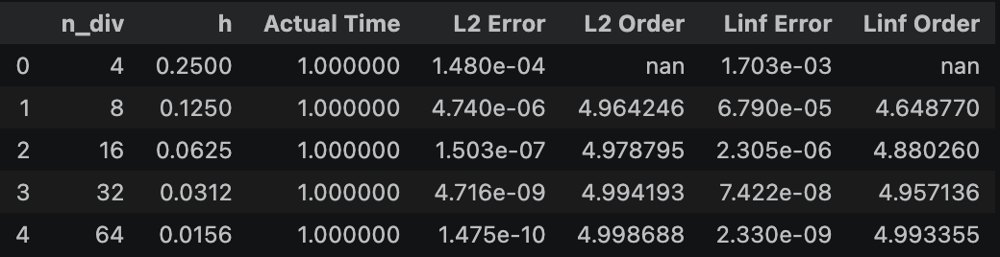
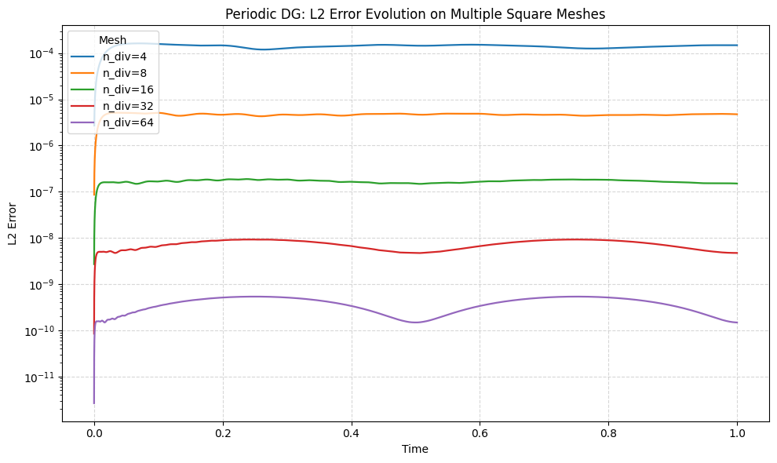
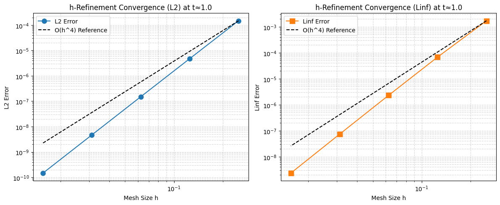

---

# 📁 Case B: FinalTime = 20, CFL = 1

---

## 🔹 B1. x-direction advection

* Velocity field: **(u, v) = (1, 0)**
* Exact solution:

```python
q_expr = sp.sin(2 * np.pi * (x - t))
```

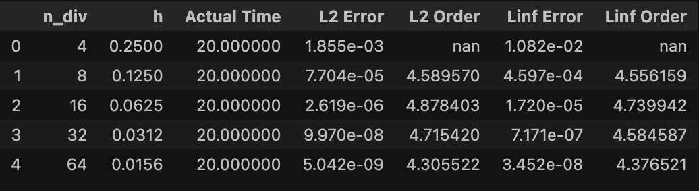

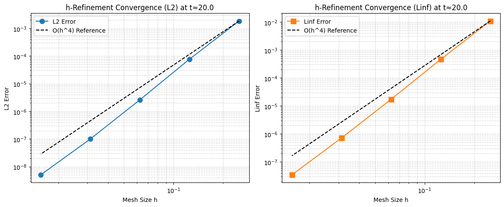

---

## 🔹 B2. y-direction advection

* Velocity field: **(u, v) = (0, 1)**
* Exact solution:

```python
q_expr = sp.sin(2 * np.pi * (y - t))
```

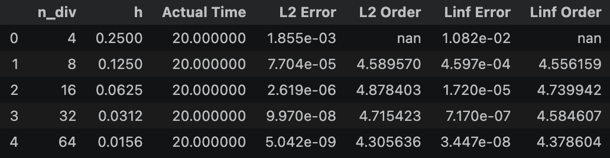
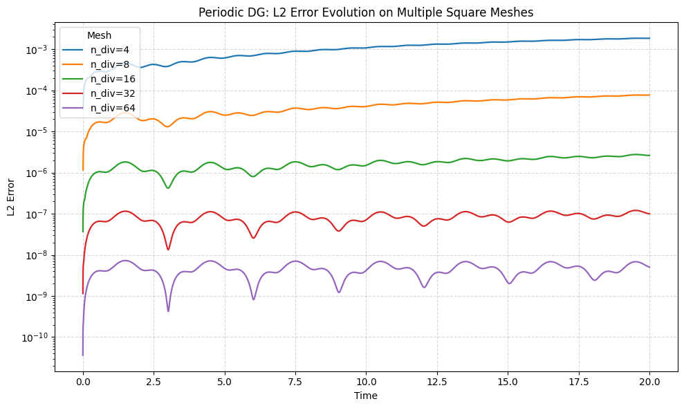
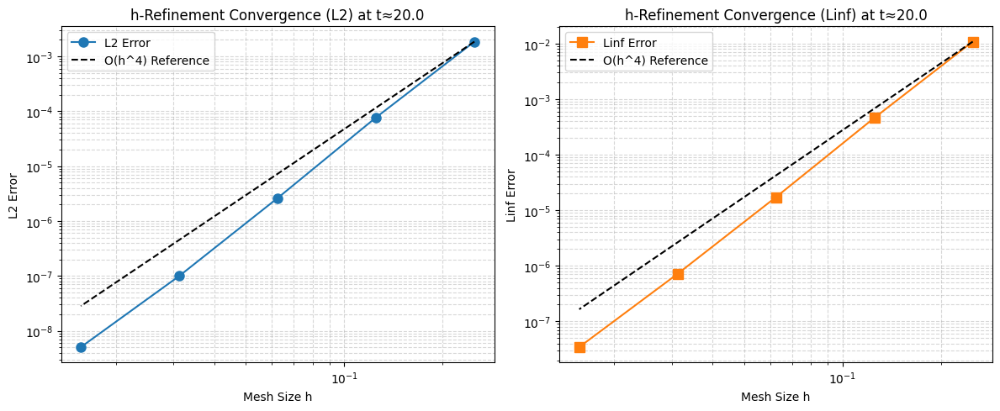

---

## 🔹 B3. Diagonal advection (xy)

* Velocity field: **(u, v) = (1, 1)**
* Exact solution:

```python
q_expr = sp.sin(2 * np.pi * (x + y - 2 * t))
```

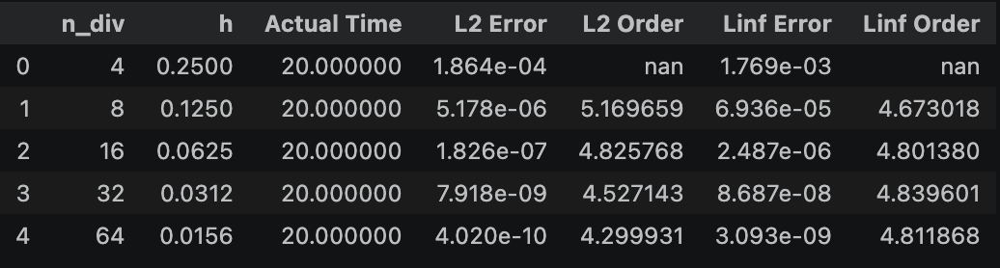
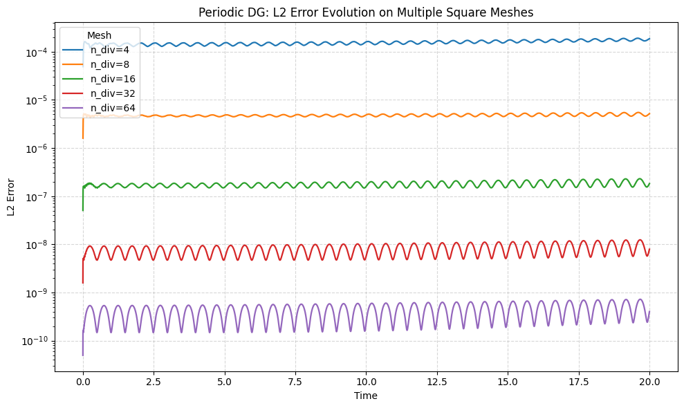
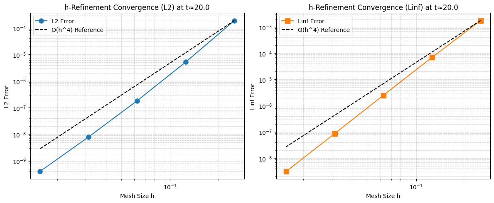

---

## 🧠 Notes

* `x`, `y`, `xy` represent wave propagation direction:

  * `x`: along x-axis
  * `y`: along y-axis
  * `xy`: diagonal direction

* Diagonal case corresponds to:

  ```
  q = sin(2π(x + y - 2t))
  ```

* All simulations use **periodic boundary conditions**

---

## 📊 Summary Table

| Case | CFL  | Final Time | Direction | Velocity |
| ---- | ---- | ---------- | --------- | -------- |
| A1   | 0.05 | 1          | x         | (1,0)    |
| A2   | 0.05 | 1          | y         | (0,1)    |
| A3   | 0.05 | 1          | xy        | (1,1)    |
| B1   | 1    | 20         | x         | (1,0)    |
| B2   | 1    | 20         | y         | (0,1)    |
| B3   | 1    | 20         | xy        | (1,1)    |

---
